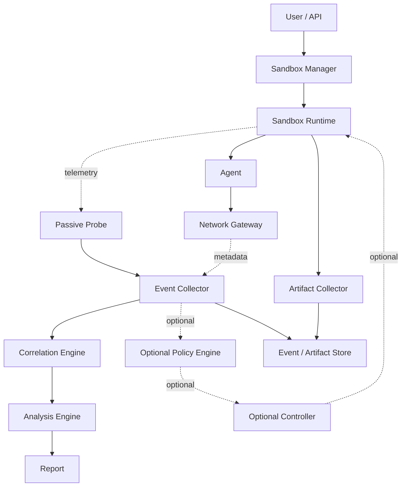

# Agent Sandbox 透明监控版 — Codex 开发规格

## 0. 文档目标

本项目是一个 **Observation-First Agent Sandbox**。

核心要求：

> Agent 默认应该按照正常方式运行。监控系统主要负责观察、记录、关联和分析，而不是修改 Agent 的执行行为。

默认模式必须是：

```text
OBSERVE ONLY
```

可选模式：

```text
PROTECT
```

其中 Protect 可以阻断行为，但不能成为默认执行路径。

---

# 1. 产品模式

系统必须支持两个明确模式。

## 1.1 OBSERVE

默认。

行为：

```text
ALLOW ALL NORMAL AGENT OPERATIONS
COLLECT TELEMETRY
STORE EVENTS
CORRELATE EVENTS
GENERATE REPORT
```

不得因为监控而：

```text
block
rewrite command
modify network response
modify file operation
inject application code
change Agent permissions
```

---

## 1.2 PROTECT

用户明确开启。

可以：

```text
ALLOW
DENY
ASK
BLOCK
PAUSE
KILL
NETWORK_ISOLATE
```

Protect 必须与 Observe 解耦。

---

# 2. 总体架构



---

# 3. 核心设计原则

## 3.1 Observation First

Probe 必须优先使用 OS 原生、旁路式观测机制。

目标：

```text
low overhead
low interference
high visibility
```

---

## 3.2 Probe 不负责策略

严格分离：

```text
Probe
  = Observe

Event Collector
  = Normalize / Store

Correlation
  = Link events

Analysis
  = Interpret

Policy
  = Decide

Controller
  = Enforce
```

---

## 3.3 默认不阻断

默认配置：

```yaml
mode: observe
```

在 observe 模式下：

```text
policy decisions may be calculated
but MUST NOT change execution
```

例如：

```text
file.read ~/.ssh/id_rsa
```

可以：

```text
event = HIGH
```

但：

```text
operation = ALLOW
```

---

# 4. 项目结构

建议：

```text
agent-sandbox/
│
├── sandbox-manager/
├── sandbox-runtime/
├── probe/
│   ├── process/
│   ├── filesystem/
│   ├── network/
│   ├── identity/
│   ├── persistence/
│   └── agent/
│
├── event-schema/
├── event-collector/
├── correlation-engine/
├── analysis-engine/
├── artifact-collector/
│
├── network-gateway/
│
├── policy-engine/
├── controller/
│
├── api/
├── web-ui/
│
├── tests/
└── docs/
```

---

# 5. 模块职责

## sandbox-manager

负责：

```text
create
start
stop
destroy
collect
```

接口示例：

```text
POST /sandboxes
POST /sandboxes/{id}/start
POST /sandboxes/{id}/stop
DELETE /sandboxes/{id}
GET  /sandboxes/{id}
```

---

## sandbox-runtime

负责：

```text
VM / Container lifecycle
resource limits
filesystem isolation
network configuration
identity
snapshot
```

第一阶段优先支持一种 Runtime，不要同时实现多个 Runtime。

---

## probe

Probe 是旁路 telemetry collector。

要求：

```text
no policy decision
no default blocking
minimal overhead
crash isolation
event buffering
```

---

# 6. Probe 数据来源

## Windows

优先考虑：

```text
ETW
Windows Event Log
Windows Security Auditing
Windows Filtering Platform
PowerShell logging
```

可选：

```text
Sysmon
```

## Linux

优先考虑：

```text
eBPF
auditd
fanotify
procfs
netlink
systemd journal
```

## macOS

优先考虑：

```text
EndpointSecurity
FSEvents
Unified Logging
Network Extension
```

不要为了第一版跨平台而强行抽象掉平台特性。

建议：

```text
common event model
+
platform-specific collectors
```

---

# 7. 第一阶段 Probe

必须支持：

```text
process.create
process.exit

shell.execute

file.create
file.read
file.write
file.rename
file.delete

network.dns
network.connect
network.close

download
upload
```

第二阶段：

```text
identity
privilege
credential
ssh
persistence
firewall
security
```

---

# 8. Agent 关联

必须知道：

```text
agent_id
session_id
root_pid
```

所有 OS 事件尽量关联到：

```text
agent_id
session_id
pid
ppid
```

进程树：

```text
Agent
 └── shell
      ├── python
      ├── curl
      └── node
```

---

# 9. Event Schema

所有事件统一：

```json
{
  "schema_version": "1.0",
  "event_id": "uuid",
  "timestamp": "2026-10-01T19:00:00+08:00",

  "sandbox_id": "sandbox-001",
  "session_id": "session-001",
  "agent_id": "agent-001",

  "actor": {
    "pid": 1234,
    "ppid": 1000,
    "user": "agent",
    "executable": "/bin/bash",
    "command_line": "..."
  },

  "action": {
    "category": "file",
    "type": "read"
  },

  "target": {
    "type": "file",
    "path": "/workspace/a.txt"
  },

  "network": null,

  "decision": {
    "mode": "observe",
    "result": "ALLOW",
    "policy_id": null
  },

  "correlation": {
    "parent_event_id": null,
    "trace_id": "trace-001"
  }
}
```

---

# 10. Event 类型

```text
agent.task.start
agent.task.end
agent.tool.call

sandbox.create
sandbox.start
sandbox.stop
sandbox.destroy

process.create
process.exit

shell.execute

file.create
file.read
file.write
file.rename
file.delete
file.permission

network.dns
network.connect
network.close
network.upload
network.download

identity.user.create
identity.user.delete
identity.group.change
identity.privilege

credential.read

ssh.login
ssh.command
ssh.key.change

firewall.change

persistence.create
persistence.modify
persistence.delete

security.change
log.clear
```

---

# 11. Observe 模式语义

Observe 模式下：

```json
{
  "decision": {
    "mode": "observe",
    "result": "ALLOW"
  }
}
```

即使分析引擎判断：

```text
risk = critical
```

也不能自动阻止 Agent。

风险和执行控制必须解耦。

---

# 12. Protect 模式语义

Protect 模式：

```json
{
  "decision": {
    "mode": "protect",
    "result": "DENY",
    "policy_id": "deny-sensitive-credential"
  }
}
```

Controller 执行实际控制。

---

# 13. Event Correlation

核心能力：

```text
Agent Task
  ↓
Tool Call
  ↓
Process
  ↓
File / Network
  ↓
Download
  ↓
Execution
  ↓
Persistence
```

实现方式建议：

```text
trace_id
parent_event_id
process lineage
session_id
sandbox_id
```

---

# 14. Process Lineage

必须支持：

```text
root_pid
pid
ppid
process_start
process_exit
executable
command_line
cwd
user
hash
```

生成：

```text
Process Tree
```

---

# 15. File Telemetry

记录：

```text
operation
path
pid
process
user
timestamp
size
hash
```

默认不保存文件内容。

需要避免：

```text
monitoring system accidentally becoming a secret repository
```

---

# 16. Network Telemetry

至少：

```text
process
pid
domain
dns
destination_ip
destination_port
protocol
bytes_sent
bytes_received
timestamp
```

HTTPS 默认不需要保存完整明文内容。

优先记录 metadata。

---

# 17. Network Gateway

第一版可以只做：

```text
DNS metadata
TCP metadata
domain allow/deny observation
upload/download metadata
```

重要：

> Observe 模式下 Network Gateway 不应改变网络行为，除非为了实现 Sandbox 本身的网络隔离而必须存在。

---

# 18. Artifact Collector

任务结束收集：

```text
agent output
created files
modified files
downloaded files
process tree
event log
network summary
```

文件 metadata：

```text
path
size
sha256
mime
created_at
modified_at
origin
```

---

# 19. Analysis Engine

第一版不要做复杂 AI 风险判断。

先实现确定性的统计和关联：

```text
process count
file read count
file write count
network connection count
download count
upload count
sensitive access count
```

再实现规则：

```text
sensitive file read
download then execute
credential read then network
large file read then upload
persistence change
security configuration change
```

---

# 20. 风险模型

风险与阻断必须分开。

事件：

```text
risk_level:
INFO
LOW
MEDIUM
HIGH
CRITICAL
```

Observe：

```text
risk = CRITICAL
execution = ALLOW
```

Protect：

```text
risk = CRITICAL
policy = DENY
execution = BLOCK
```

---

# 21. Agent Tool Call

如果 Agent 本身提供 Tool Call 日志，记录：

```text
agent_id
session_id
tool_name
arguments
timestamp
result
```

然后和 OS 行为关联：

```text
Tool Call
   ↓
Process
   ↓
File
   ↓
Network
```

例如：

```text
tool = shell
args = "npm install"
        ↓
process = npm
        ↓
network = registry.npmjs.org
        ↓
file = package-lock.json
```

---

# 22. MCP

如果使用 MCP：

```text
mcp.server.start
mcp.tool.call
mcp.tool.result
```

记录：

```text
server
tool
arguments
process
session
result
```

不要因为 MCP 存在而修改 Agent Tool 行为。

---

# 23. Sandbox Lifecycle

```text
CREATED
  ↓
STARTING
  ↓
RUNNING
  ↓
FINISHED
  ↓
COLLECTING
  ↓
DESTROYED
```

可选：

```text
PAUSED
TERMINATED
```

---

# 24. Snapshot

目标：

```text
Task N
 ↓
Clean Snapshot
 ↓
Sandbox
 ↓
Agent
 ↓
Collect
 ↓
Destroy
```

下一次：

```text
Clean Snapshot
 ↓
New Sandbox
```

不能让任务 N 的状态泄漏到任务 N+1。

---

# 25. 安全边界

虽然默认是 Observe，但 Sandbox 本身仍然必须保护宿主机。

要求：

```text
Agent cannot escape Sandbox
Agent cannot modify host
Agent cannot modify Probe outside Sandbox
Agent cannot modify Event Store
Agent cannot modify Control Plane
```

这是 Sandbox 的基础隔离责任，不等于对 Agent 行为进行业务层阻断。

---

# 26. “不影响 Agent”的验收标准

必须建立性能基线：

```text
Baseline:
Agent without Probe

Test:
Agent with Probe / Observe Mode
```

比较：

```text
task completion
latency
CPU
memory
network throughput
file throughput
process startup time
```

目标：

```text
minimal overhead
no functional regression
```

---

# 27. 监控完整性测试

准备测试 Agent：

```text
create process
read file
write file
delete file
rename file
DNS
TCP
download
upload
SSH
create user
change permission
create persistence
```

验证：

```text
每个行为都产生 Event
```

---

# 28. Probe 故障原则

Probe 崩溃时不要默认影响 Agent。

Observe 模式：

```text
Probe crash
   ↓
Agent continues
```

同时：

```text
health event
probe.status = unhealthy
```

管理员可以看到：

```text
Telemetry coverage degraded
```

而不是：

```text
Agent automatically killed
```

Protect 模式可以由管理员选择：

```text
fail-open
fail-closed
```

但必须显式配置。

---

# 29. 性能原则

Probe 必须：

```text
async
buffered
non-blocking where possible
bounded memory
backpressure aware
```

不要：

```text
每次系统调用都同步发送 HTTP
```

推荐：

```text
OS Event
  ↓
Local Ring Buffer
  ↓
Batch
  ↓
Collector
```

---

# 30. 数据隐私

默认不要采集：

```text
password
private key
API token
cookie
完整 HTTP body
完整 clipboard
```

可保存：

```text
hash
fingerprint
metadata
redacted preview
```

---

# 31. Web UI

第一版需要：

## Dashboard

```text
Sandbox
Agent
Task
Duration
Process Count
File Events
Network Events
Download Count
Sensitive Events
```

## Timeline

```text
timestamp
action
process
target
risk
```

## Process Tree

```text
Agent
 └── shell
      ├── python
      └── node
```

## Network

```text
process
domain
IP
port
bytes
```

## Files

```text
operation
path
process
hash
```

---

# 32. API

建议最小 API：

```text
POST /sandboxes
GET /sandboxes
GET /sandboxes/{id}
POST /sandboxes/{id}/start
POST /sandboxes/{id}/stop
DELETE /sandboxes/{id}

GET /sandboxes/{id}/events
GET /sandboxes/{id}/process-tree
GET /sandboxes/{id}/network
GET /sandboxes/{id}/files
GET /sandboxes/{id}/artifacts
GET /sandboxes/{id}/report
```

Protect 模式额外：

```text
POST /sandboxes/{id}/pause
POST /sandboxes/{id}/resume
POST /sandboxes/{id}/network-isolate
POST /sandboxes/{id}/kill
```

---

# 33. MVP 开发顺序

## Phase 1

只完成：

```text
Sandbox lifecycle
Agent lifecycle
Process telemetry
File telemetry
Network telemetry
Event schema
Event collector
```

目标：

> 能看到 Agent 做了什么。

---

## Phase 2

增加：

```text
Process Tree
Timeline
Artifact Collector
Network Dashboard
File Dashboard
```

目标：

> 能看懂 Agent 做了什么。

---

## Phase 3

增加：

```text
Correlation
Behavior Graph
Sensitive Resource Detection
Risk Analysis
```

目标：

> 能理解 Agent 行为之间的关系。

---

## Phase 4

增加：

```text
Optional Policy
Protect Mode
Controller
Block
Pause
Network Isolation
```

目标：

> 在需要时才控制 Agent。

---

# 34. Codex 执行规则

Codex 必须遵守：

1. 不要默认实现阻断。
2. 不要让 Probe 进入 Agent 的同步执行路径。
3. 不要修改 Agent Tool 行为。
4. 不要重写 Agent 命令。
5. 不要默认修改网络响应。
6. 不要默认保存敏感数据明文。
7. 所有 Event 必须带 sandbox_id。
8. 所有 Agent 行为尽可能带 session_id。
9. 所有进程事件关联 PID/PPID。
10. 文件事件关联 Process。
11. 网络事件关联 Process。
12. Observe 与 Protect 必须代码层面分离。
13. Probe 故障默认不能导致 Agent 被杀死。
14. 每个 Collector 都必须有独立测试。
15. 每个 Event Schema 必须有版本号。

---

# 35. 测试矩阵

| 测试 | Observe | Protect |
|---|---:|---:|
| Shell | 允许+记录 | 策略决定 |
| File Read | 允许+记录 | 策略决定 |
| File Write | 允许+记录 | 策略决定 |
| Network | 允许+记录 | 策略决定 |
| Download | 允许+记录 | 策略决定 |
| Process | 允许+记录 | 策略决定 |
| Credential Read | 允许+记录+风险 | 策略决定 |
| Persistence | 允许+记录+风险 | 策略决定 |
| Firewall Change | 允许+记录+风险 | 策略决定 |

---

# 36. 最终验收标准

系统必须做到：

```text
[ ] Agent 可以正常执行任务
[ ] Probe 默认不阻断
[ ] Probe 故障不影响 Observe 模式下 Agent
[ ] 可以看到完整进程树
[ ] 可以看到 Shell
[ ] 可以看到文件行为
[ ] 可以看到网络行为
[ ] 可以看到下载
[ ] 可以看到上传
[ ] 可以识别敏感资源
[ ] 可以关联 Agent Tool Call
[ ] 可以形成行为时间线
[ ] 可以生成任务报告
[ ] 每次任务可以从干净环境开始
```

Protect Mode 作为后续能力：

```text
[ ] 可以显式开启
[ ] 可以阻断
[ ] 可以暂停
[ ] 可以断网
[ ] 可以终止
```

---

# 37. 最终产品模型

```text
                AGENT
                  │
                  ▼
          ┌───────────────┐
          │ Sandbox / OS  │
          │               │
          │ Agent 正常运行 │
          └───────┬───────┘
                  │
             Passive
            Observation
                  │
                  ▼
             ┌────────┐
             │ Probe  │
             └───┬────┘
                 ▼
          ┌──────────────┐
          │ Event Engine │
          └──────┬───────┘
                 ▼
          ┌──────────────┐
          │ Correlation  │
          └──────┬───────┘
                 ▼
          ┌──────────────┐
          │   Analysis   │
          └──────┬───────┘
                 ▼
              Report

       Optional Protection
                 │
                 ▼
        Policy / Controller
```

最终原则：

> **默认 Observe，不默认 Protect。**

> **Sandbox 的主要价值是隔离和可重复运行；Probe 的主要价值是透明观察；Analysis 的主要价值是理解行为；Protection 是可选增强能力。**
