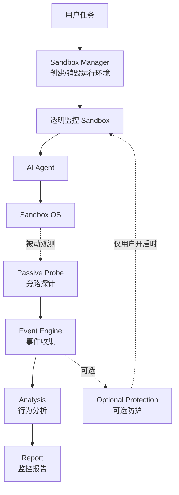
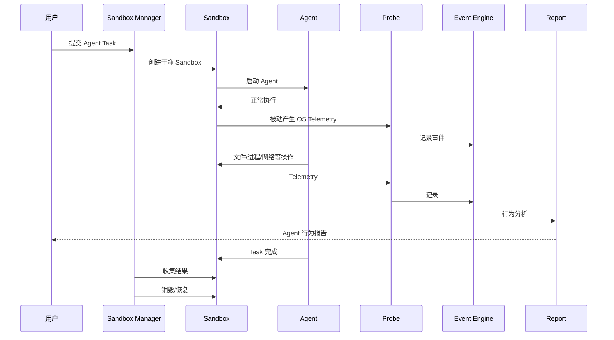
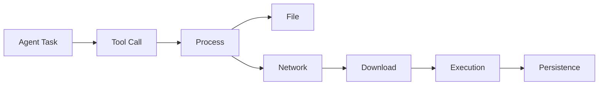
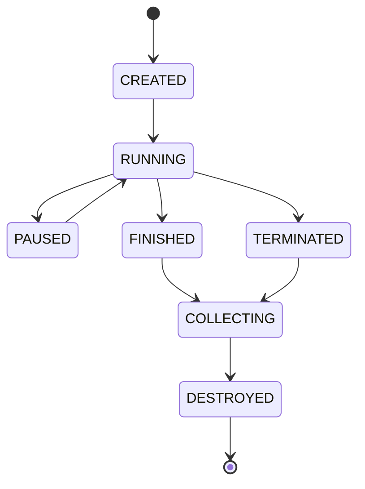

# Agent Sandbox 透明监控工作模式

> 产品定位：**透明监控型 Agent Sandbox**
>
> 核心目标：让 Agent 在尽可能接近原生环境的条件下正常运行，同时完整记录其行为。默认只观察、不阻断、不修改 Agent 行为。

---

## 1. 一句话理解

把 Agent 放进一个独立的“实验室”。

- Agent：正常工作
- Sandbox：提供独立运行环境
- Probe：像摄像头一样观察
- Event Engine：记录发生了什么
- Analysis：把事件串成行为链
- Report：告诉用户 Agent 做了什么
- Protection：可选，默认关闭



---

# 2. 最重要的产品原则

## 默认不干预 Agent

Agent 应该按照自己的正常方式运行：

```text
Shell
文件读写
网络访问
下载
安装软件
启动进程
运行脚本
Git
Python
Node
MCP
浏览器
```

监控系统默认不改变这些行为。

```text
Agent
  ↓
正常 OS
  ↓
正常执行

        ╲
         ╲ 被动观察
          ▼
         Probe
```

---

# 3. Observe 和 Protect 必须分开

这是产品最重要的设计原则之一。

## Observe Mode

默认模式：

```text
观察
记录
分析
报告
```

不做：

```text
阻断
修改命令
修改网络响应
修改文件
注入 Agent
强制改变权限
```

例如：

```text
Agent 读取 ~/.ssh/id_rsa
        ↓
Probe 记录
        ↓
标记 Sensitive
        ↓
报告
        ↓
Agent 继续运行
```

---

## Protect Mode

用户明确开启后才允许：

```text
ALLOW
DENY
ASK
BLOCK
KILL
NETWORK ISOLATE
PAUSE
```

例如：

```text
Agent 读取 ~/.ssh/id_rsa
        ↓
Probe 发现
        ↓
Policy 判断
        ↓
DENY
        ↓
Controller 执行阻断
```

---

# 4. 为什么仍然需要 Sandbox

这里的 Sandbox 不是主要为了限制 Agent。

主要作用是：

### 4.1 隔离

Agent 的实验环境与真实主机分离。

### 4.2 可重复

每次任务都可以从干净状态开始。

### 4.3 可恢复

Agent 做了大量修改后，可以直接销毁。

### 4.4 可观测

所有 Agent 行为都集中在一个独立环境中，方便关联。

---

# 5. 完整工作流程



---

# 6. Probe 应该是什么

Probe 是整个系统的“观察员”。

它主要负责：

```text
Process
File
Network
DNS
Shell
User
Privilege
SSH
Persistence
Security Change
Download
Upload
Agent Tool Call
```

它的原则：

> **Observe first, decide elsewhere.**

也就是说：

```text
Probe = 看见
Analysis = 理解
Policy = 决定
Controller = 执行
```

---

# 7. Probe 不应该成为 Agent 的代理

不推荐：

```text
Agent
  ↓
Probe
  ↓
OS
```

因为 Probe 进入 Agent 的执行路径后，有可能：

- 改变执行时序
- 增加延迟
- 改变错误行为
- 影响网络
- 改变文件操作
- 影响 Agent 的兼容性

更推荐：

```text
             Agent
               │
               ▼
              OS
          ┌────┼────┐
          │    │    │
        File Process Network
          │    │    │
          └────┼────┘
               ▼
             Probe
               │
               ▼
          Event Engine
```

也就是尽可能通过操作系统提供的观测机制获得事件。

---

# 8. 第一版监控清单

## Process

```text
Process Create
Process Exit
Parent / Child
Executable
Command Line
PID / PPID
User
Hash
```

## Shell

```text
Bash
Zsh
sh
PowerShell
cmd
Python
Node
```

## File

```text
Create
Read
Write
Rename
Delete
Permission Change
```

## Network

```text
DNS
TCP
UDP
Connection
Destination
Bytes
Process
```

## Download / Upload

```text
Source
Destination
File
Process
Size
Hash
```

## Identity

```text
User
Group
Privilege
sudo
Administrator
SYSTEM
root
```

## Persistence

```text
Service
Scheduled Task
Cron
Startup
LaunchAgent
systemd
```

## Agent

```text
Tool Call
MCP
Shell Tool
File Tool
Browser Tool
Network Tool
```

---

# 9. 行为链

系统不要只展示大量日志。

应该把事件关联成：



例如：

```text
Agent Task
  ↓
shell
  ↓
curl
  ↓
下载文件
  ↓
写入 /tmp
  ↓
执行
  ↓
访问外部网络
```

---

# 10. 用户最终看到什么

首页应该尽量简单。

```text
┌─────────────────────────────────────┐
│ Agent Sandbox                       │
├─────────────────────────────────────┤
│ Agent       Coding Agent            │
│ Task        Run tests               │
│ Status      RUNNING                 │
├─────────────────────────────────────┤
│ Processes           23              │
│ File Events       1,284             │
│ Network Events      126             │
│ Downloads             7             │
│ Sensitive Events      3             │
├─────────────────────────────────────┤
│ Timeline                            │
│                                     │
│ ✓ npm install                       │
│ ✓ python test.py                    │
│ ✓ 访问 registry.npmjs.org          │
│ ! 读取敏感文件                      │
│ ✓ 下载依赖                          │
└─────────────────────────────────────┘
```

---

# 11. 行为时间线

例如：

```text
19:00:01  Agent Started

19:00:02  Process
          npm install

19:00:03  Network
          registry.npmjs.org

19:00:05  File
          package-lock.json

19:00:10  Process
          node

19:01:02  Download
          package.tar.gz

19:01:20  Sensitive File
          ~/.ssh/id_rsa
```

最后一项默认：

```text
记录 + 提醒
```

而不是：

```text
自动阻止
```

---

# 12. 风险分析

可以给事件增加：

```text
INFO
LOW
MEDIUM
HIGH
CRITICAL
```

但风险评级只是分析结果。

默认不意味着：

```text
HIGH → 阻断
```

而是：

```text
HIGH
 ↓
报告
 ↓
用户决定是否开启 Protection
```

---

# 13. Artifact

任务结束后收集：

```text
Agent 输出
修改后的项目文件
新生成文件
下载文件
行为日志
进程树
网络摘要
行为报告
```

默认优先保存：

```text
Path
Size
SHA256
MIME
Timestamp
Origin
```

不要默认保存：

```text
Password
Token
Cookie
Private Key
完整 HTTP Body
```

---

# 14. Sandbox 生命周期



默认：

```text
创建
 ↓
运行
 ↓
观察
 ↓
收集
 ↓
销毁
```

---

# 15. 最终产品定位

不要把它定位成：

> “限制 Agent 的安全沙箱”

而应该定位成：

> **“用于观察、审计和理解 AI Agent 实际行为的隔离运行环境。”**

可选的 Protect Mode 是附加能力，而不是默认行为。

---

# 16. 最核心的产品原则

```text
透明运行
      ↓
被动观测
      ↓
完整记录
      ↓
行为关联
      ↓
风险分析
      ↓
报告
```

而不是：

```text
Agent
 ↓
拦截
 ↓
修改
 ↓
限制
```

